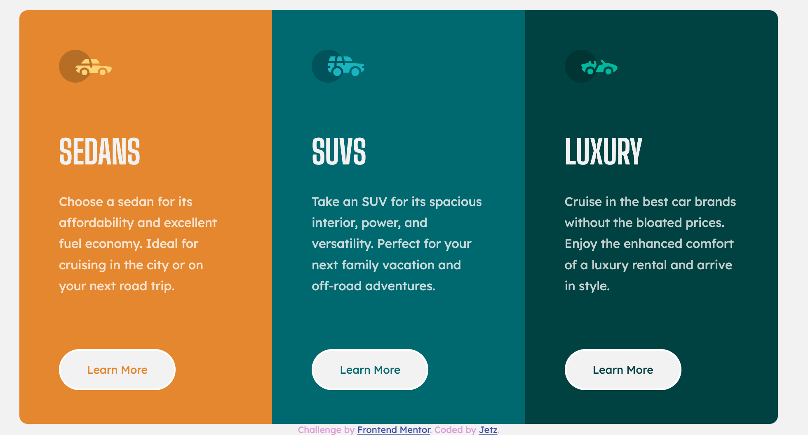

# Frontend Mentor - 3-column preview card component solution

This is my solution to the 3-column preview card component challenge on Frontend Mentor

### Screenshot

- Solution Frontend Mentor: [@JCJetz](https://www.frontendmentor.io/profile/JCJetz)
- Live Site URL: [github](https://jcjetz.github.io/3-column-preview-card-component/)

The challenge

Users should be able to:

View the optimal layout depending on their device's screen size.
See hover states for interactive elements.

Want some support on the challenge? [Join our Slack community](https://www.frontendmentor.io/slack) and ask questions in the **#help** channel.

### Useful Resources 

⭐ https://www.w3.org/TR/css3-mediaqueries/

⭐ https://developer.mozilla.org/es/docs/Web/CSS/Media_Queries/Using_media_queries

⭐ https://3con14.biz/css/unidades,-color/11-unidades-en-css.html

### Built with

- Semantic HTML
- CSS custom properties

